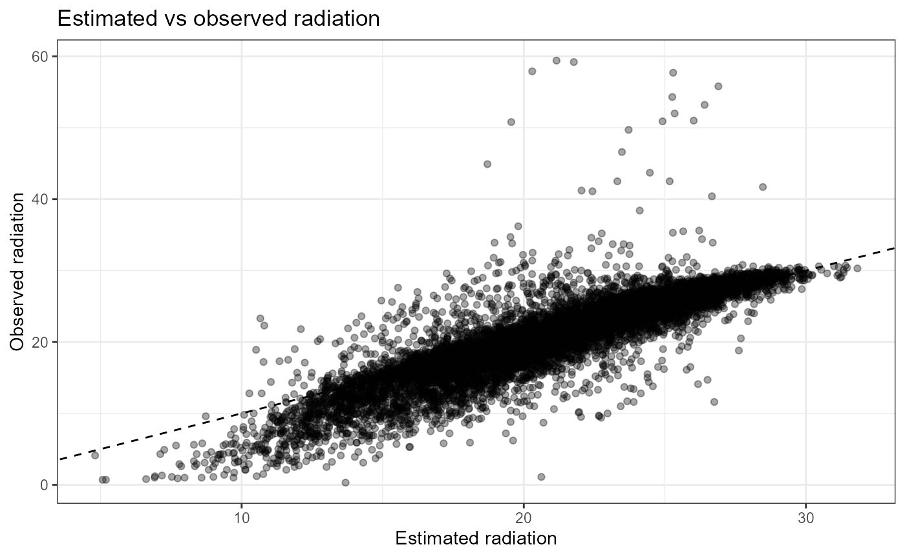
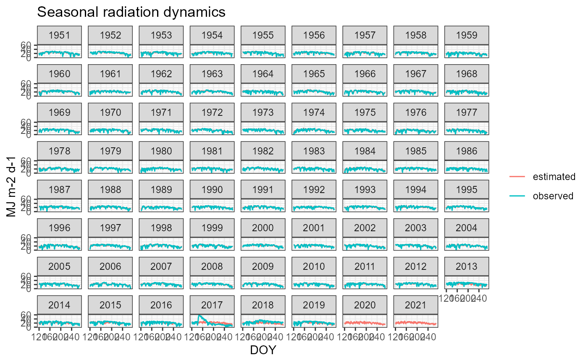
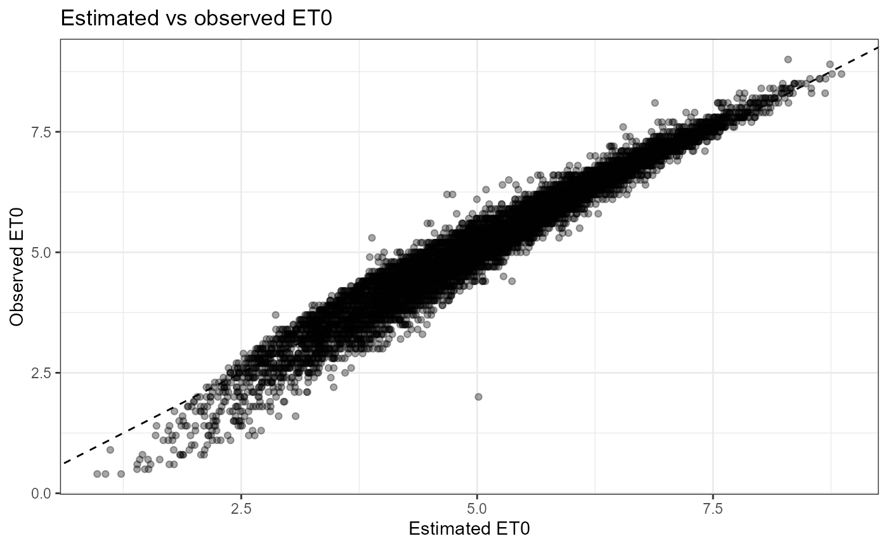
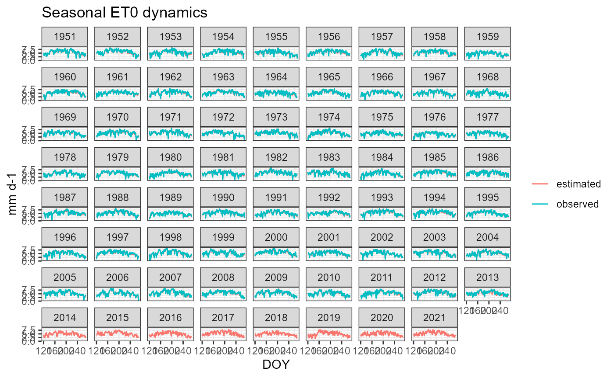

# Calibration of ET0 and Radiation for Tomato Irrigation with cumba

``` r

library(cumba)
library(dplyr)
library(ggplot2)
library(lubridate)
library(readr)
```

## Read observed weather data

Use the shipped CSV containing observed radiation (Rg) and ET0.

``` r

csv_file <- system.file(
  "testFiles",
  "weather_foggia.csv",
  package = "cumba"
)
weather <- read_csv("..//testFiles/weather_foggia.csv") |> 
  mutate(MDATE = as.Date(MDATE,format = '%m/%d/%Y')) |> 
  rename(P = RAIN, Tx = TMAX, Tn = TMIN,DATE = MDATE) |> 
  mutate(Lat=41,Site = 'Foggia',
         Rg = as.numeric(Rg),ET0=as.numeric(ET0))
```

    ## Rows: 25933 Columns: 7
    ## ── Column specification ────────────────────────────────────────────────────────
    ## Delimiter: ","
    ## chr (3): MDATE, Rg, ET0
    ## dbl (4): TMAX, TMIN, RH, RAIN
    ## 
    ## ℹ Use `spec()` to retrieve the full column specification for this data.
    ## ℹ Specify the column types or set `show_col_types = FALSE` to quiet this message.

    ## Warning: There were 2 warnings in `mutate()`.
    ## The first warning was:
    ## ℹ In argument: `Rg = as.numeric(Rg)`.
    ## Caused by warning:
    ## ! NAs introduced by coercion
    ## ℹ Run `dplyr::last_dplyr_warnings()` to see the 1 remaining warning.

``` r

glimpse(weather)
```

    ## Rows: 25,933
    ## Columns: 9
    ## $ DATE <date> 1951-01-01, 1951-01-02, 1951-01-03, 1951-01-04, 1951-01-05, 1951…
    ## $ Tx   <dbl> 10.0, 14.8, 10.2, 9.1, 12.0, 11.0, 9.0, 12.2, 11.2, 12.5, 13.1, 1…
    ## $ Tn   <dbl> 3.0, 4.0, 6.4, 6.4, 4.3, 6.1, 3.2, 3.0, 4.0, 3.1, 1.0, 5.1, 5.5, …
    ## $ RH   <dbl> 61.7, 48.3, 77.2, 83.2, 59.2, 71.7, 66.9, 53.3, 61.1, 52.7, 43.6,…
    ## $ P    <dbl> 0.3, 0.0, 42.0, 0.0, 0.0, 13.2, 1.0, 0.0, 5.6, 1.2, 0.0, 0.5, 0.0…
    ## $ Rg   <dbl> 3.0, 5.1, 1.2, 1.2, 3.2, 2.9, 2.7, 4.7, 4.0, 6.1, 5.8, 5.0, 6.6, …
    ## $ ET0  <dbl> 1.2, 1.7, 0.7, 0.6, 1.4, 1.1, 1.1, 1.5, 1.3, 1.5, 1.7, 1.6, 1.8, …
    ## $ Lat  <dbl> 41, 41, 41, 41, 41, 41, 41, 41, 41, 41, 41, 41, 41, 41, 41, 41, 4…
    ## $ Site <chr> "Foggia", "Foggia", "Foggia", "Foggia", "Foggia", "Foggia", "Fogg…

Expected columns:

- DATE
- Tx
- Tn
- P
- Rg
- ET0
- Site
- Lat

## Run CUMBA with internal estimators

``` r

weather_pkg <- 
out <- cumba_scenario(
  weather     = weather |> select(-c(Rg,ET0)),
  param       = cumbaParameters,
  estimateRad = TRUE,
  estimateET0 = TRUE,
  fullOut     = TRUE
)
```

    ## CUMBA running in deficit irrigation mode
    ## 🍅 running experiment  1  in site  Foggia  and year  1951 
    ## 🍅 running experiment  2  in site  Foggia  and year  1952 
    ## 🍅 running experiment  3  in site  Foggia  and year  1953 
    ## 🍅 running experiment  4  in site  Foggia  and year  1954 
    ## 🍅 running experiment  5  in site  Foggia  and year  1955 
    ## 🍅 running experiment  6  in site  Foggia  and year  1956 
    ## 🍅 running experiment  7  in site  Foggia  and year  1957 
    ## 🍅 running experiment  8  in site  Foggia  and year  1958 
    ## 🍅 running experiment  9  in site  Foggia  and year  1959 
    ## 🍅 running experiment  10  in site  Foggia  and year  1960 
    ## 🍅 running experiment  11  in site  Foggia  and year  1961 
    ## 🍅 running experiment  12  in site  Foggia  and year  1962 
    ## 🍅 running experiment  13  in site  Foggia  and year  1963 
    ## 🍅 running experiment  14  in site  Foggia  and year  1964 
    ## 🍅 running experiment  15  in site  Foggia  and year  1965 
    ## 🍅 running experiment  16  in site  Foggia  and year  1966 
    ## 🍅 running experiment  17  in site  Foggia  and year  1967 
    ## 🍅 running experiment  18  in site  Foggia  and year  1968 
    ## 🍅 running experiment  19  in site  Foggia  and year  1969 
    ## 🍅 running experiment  20  in site  Foggia  and year  1970 
    ## 🍅 running experiment  21  in site  Foggia  and year  1971 
    ## 🍅 running experiment  22  in site  Foggia  and year  1972 
    ## 🍅 running experiment  23  in site  Foggia  and year  1973 
    ## 🍅 running experiment  24  in site  Foggia  and year  1974 
    ## 🍅 running experiment  25  in site  Foggia  and year  1975 
    ## 🍅 running experiment  26  in site  Foggia  and year  1976 
    ## 🍅 running experiment  27  in site  Foggia  and year  1977 
    ## 🍅 running experiment  28  in site  Foggia  and year  1978 
    ## 🍅 running experiment  29  in site  Foggia  and year  1979 
    ## 🍅 running experiment  30  in site  Foggia  and year  1980 
    ## 🍅 running experiment  31  in site  Foggia  and year  1981 
    ## 🍅 running experiment  32  in site  Foggia  and year  1982 
    ## 🍅 running experiment  33  in site  Foggia  and year  1983 
    ## 🍅 running experiment  34  in site  Foggia  and year  1984 
    ## 🍅 running experiment  35  in site  Foggia  and year  1985 
    ## 🍅 running experiment  36  in site  Foggia  and year  1986 
    ## 🍅 running experiment  37  in site  Foggia  and year  1987 
    ## 🍅 running experiment  38  in site  Foggia  and year  1988 
    ## 🍅 running experiment  39  in site  Foggia  and year  1989 
    ## 🍅 running experiment  40  in site  Foggia  and year  1990 
    ## 🍅 running experiment  41  in site  Foggia  and year  1991 
    ## 🍅 running experiment  42  in site  Foggia  and year  1992 
    ## 🍅 running experiment  43  in site  Foggia  and year  1993 
    ## 🍅 running experiment  44  in site  Foggia  and year  1994 
    ## 🍅 running experiment  45  in site  Foggia  and year  1995 
    ## 🍅 running experiment  46  in site  Foggia  and year  1996 
    ## 🍅 running experiment  47  in site  Foggia  and year  1997 
    ## 🍅 running experiment  48  in site  Foggia  and year  1998 
    ## 🍅 running experiment  49  in site  Foggia  and year  1999 
    ## 🍅 running experiment  50  in site  Foggia  and year  2000 
    ## 🍅 running experiment  51  in site  Foggia  and year  2001 
    ## 🍅 running experiment  52  in site  Foggia  and year  2002 
    ## 🍅 running experiment  53  in site  Foggia  and year  2003 
    ## 🍅 running experiment  54  in site  Foggia  and year  2004 
    ## 🍅 running experiment  55  in site  Foggia  and year  2005 
    ## 🍅 running experiment  56  in site  Foggia  and year  2006 
    ## 🍅 running experiment  57  in site  Foggia  and year  2007 
    ## 🍅 running experiment  58  in site  Foggia  and year  2008 
    ## 🍅 running experiment  59  in site  Foggia  and year  2009 
    ## 🍅 running experiment  60  in site  Foggia  and year  2010 
    ## 🍅 running experiment  61  in site  Foggia  and year  2011 
    ## 🍅 running experiment  62  in site  Foggia  and year  2012 
    ## 🍅 running experiment  63  in site  Foggia  and year  2013 
    ## 🍅 running experiment  64  in site  Foggia  and year  2014 
    ## 🍅 running experiment  65  in site  Foggia  and year  2015 
    ## 🍅 running experiment  66  in site  Foggia  and year  2016 
    ## 🍅 running experiment  67  in site  Foggia  and year  2017 
    ## 🍅 running experiment  68  in site  Foggia  and year  2018 
    ## 🍅 running experiment  69  in site  Foggia  and year  2019 
    ## 🍅 running experiment  70  in site  Foggia  and year  2020 
    ## 🍅 running experiment  71  in site  Foggia  and year  2021 
    ## 

``` r

sim <- out |>
  select(year, doy, radiation, et0)
```

## Join observed and simulated

``` r

obs <- weather |>
  mutate(
    DATE = as.Date(DATE,format = '%m/%d/%Y'),
    year = year(DATE),
    doy  = yday(DATE)
  ) |>
  select(year, doy, Rg, ET0)

cmp <- sim |>
  inner_join(obs, by = c("year", "doy"))
```

## Radiation

``` r

ggplot(cmp, aes(radiation, Rg)) +
  geom_point(alpha=.35) +
  geom_abline(slope=1, intercept=0, linetype=2) +
  labs(
    x = "Estimated radiation",
    y = "Observed radiation",
    title = "Estimated vs observed radiation"
  ) +
  theme_bw()
```

    ## Warning: Removed 302 rows containing missing values or values outside the scale range
    ## (`geom_point()`).



``` r

ggplot(cmp, aes(doy)) +
  geom_line(aes(y = radiation, colour = "estimated")) +
  geom_line(aes(y = Rg, colour = "observed")) +
  facet_wrap(~year) +
  labs(
    x = "DOY",
    y = "MJ m-2 d-1",
    colour = NULL,
    title = "Seasonal radiation dynamics"
  ) +
  theme_bw()
```

    ## Warning: Removed 302 rows containing missing values or values outside the scale range
    ## (`geom_line()`).



## ET0

``` r

ggplot(cmp, aes(et0, ET0)) +
  geom_point(alpha=.35) +
  geom_abline(slope=1, intercept=0, linetype=2) +
  labs(
    x = "Estimated ET0",
    y = "Observed ET0",
    title = "Estimated vs observed ET0"
  ) +
  theme_bw()
```

    ## Warning: Removed 1208 rows containing missing values or values outside the scale range
    ## (`geom_point()`).



``` r

ggplot(cmp, aes(doy)) +
  geom_line(aes(y = et0, colour = "estimated")) +
  geom_line(aes(y = ET0, colour = "observed")) +
  facet_wrap(~year) +
  labs(
    x = "DOY",
    y = "mm d-1",
    colour = NULL,
    title = "Seasonal ET0 dynamics"
  ) +
  theme_bw()
```

    ## Warning: Removed 1208 rows containing missing values or values outside the scale range
    ## (`geom_line()`).



## Performance metrics

``` r

cmp |>
  summarise(
    RMSE_rad = sqrt(mean((radiation - Rg)^2, na.rm = TRUE)),
    Bias_rad = mean(radiation - Rg, na.rm = TRUE),
    R2_rad   = cor(radiation, Rg, use = "complete.obs")^2,

    RMSE_et0 = sqrt(mean((et0 - ET0)^2, na.rm = TRUE)),
    Bias_et0 = mean(et0 - ET0, na.rm = TRUE),
    R2_et0   = cor(et0, ET0, use = "complete.obs")^2
  )
```

    ##   RMSE_rad  Bias_rad    R2_rad  RMSE_et0   Bias_et0    R2_et0
    ## 1 2.999591 0.1901638 0.7574204 0.3168735 -0.1020532 0.9566861
